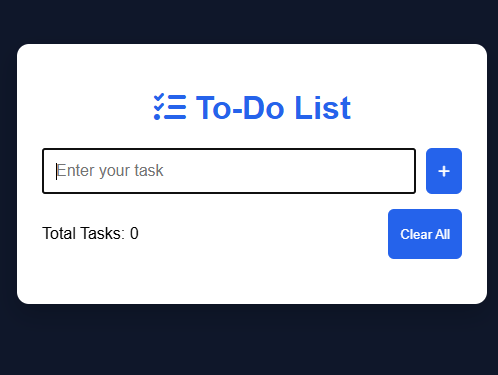
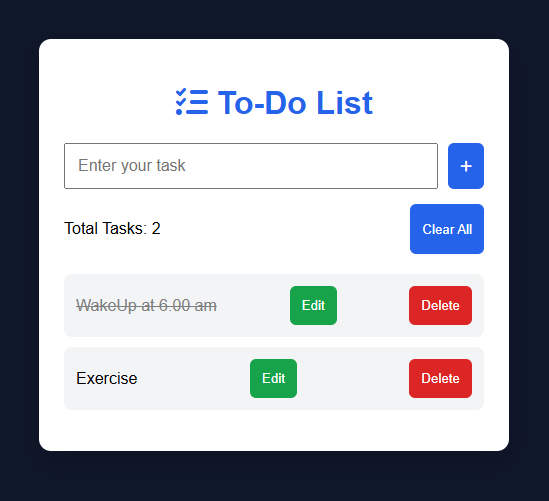

# 📝 To-Do List Application

A simple and responsive **To-Do List** web application built using **HTML, CSS, and JavaScript**. This project helps users organize their daily tasks efficiently with an intuitive interface and local storage support.
## 🚀 Live Demo

🔗 https://eeshward.github.io/To-Do-List-Application/

> Replace the above link with your GitHub Pages URL after deployment.

---
## ✨ Features
- ➕ Add new tasks
- ✅ Mark tasks as completed
- ✏️ Edit existing tasks
- 🗑 Delete tasks
- 💾 Save tasks using Local Storage
- 📱 Responsive design
- ⌨️ Press Enter to quickly add tasks
---
## 🛠️ Tech Stack
- HTML5
- CSS3
- JavaScript
- Local Storage
---
## 📂 Project Structure
```
To-Do-List-Application/
│── index.html
│── style.css
│── script.js
│── README.md
│── .gitignore
│── screenshots/
```
---
## 📸 Screenshots
### Home Page

### Task Management

---
## ⚙️ How to Run
1. Clone the repository
```bash
git clone https://github.com/Eeshward/To-Do-List-Application.git
```
2. Open the project folder.
3. Double-click **index.html** or open it using any web browser.
---
## 🎯 Future Enhancements
- 🌙 Dark Mode
- 🔍 Search Tasks
- 📅 Due Date Support
- ⭐ Task Priority
- 📊 Progress Tracker
- 🎨 Improved UI/UX
---
## 👨‍💻 Author
**Dharavath Eeshwar**
- GitHub: https://github.com/Eeshward
---

## 📄 License

This project is open-source and available under the **MIT License**.
